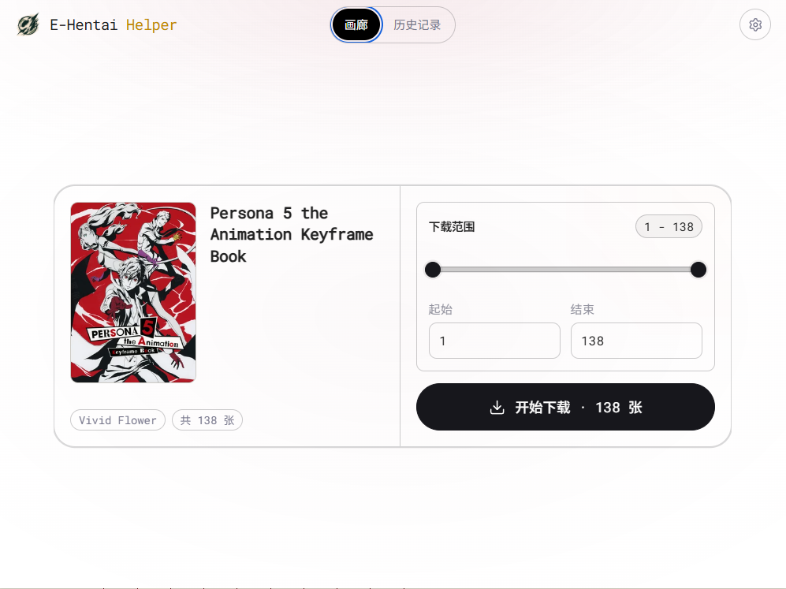
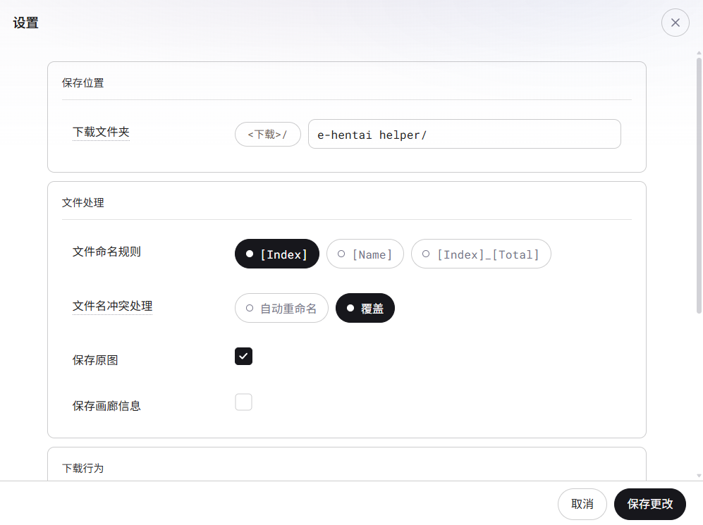
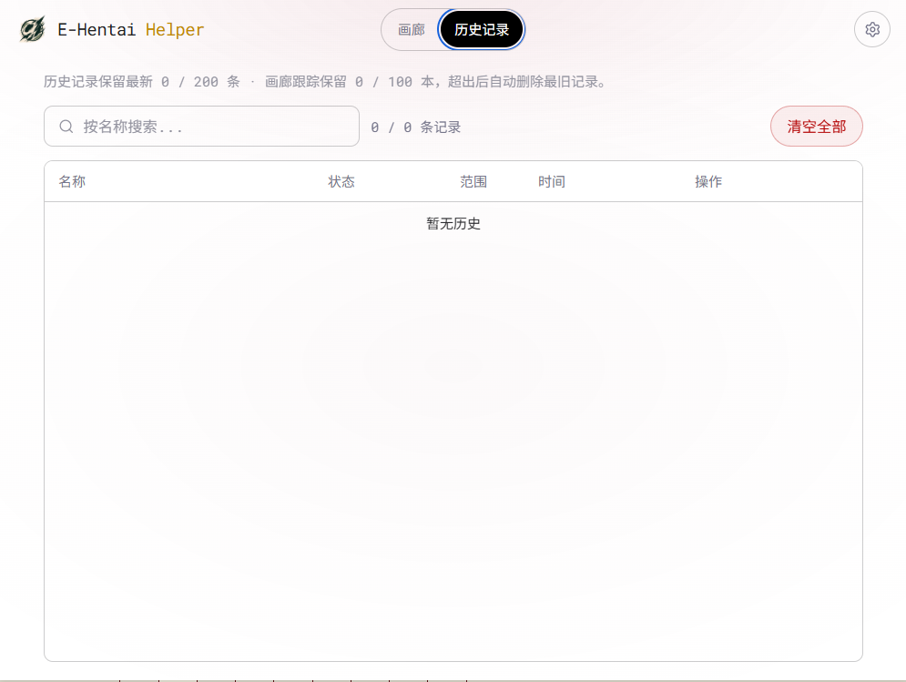

<h4 align="right"><strong>English</strong> | <a href="./README_CN.md">简体中文</a></h4>

<h1>E-Hentai Helper</h1>

A Chrome / Edge (Chromium) extension for downloading galleries from E-Hentai and ExHentai — no GP or credits; resume from history and export CBZ.

✨ If this extension helps you, a Star would be appreciated 🤗

## Usage

Take Google Chrome as an example:

1. Go to the [Release Page](../../releases) to download the zip file and extract it
2. Open `chrome://extensions`
3. Enable **Developer mode**
4. Click **Load unpacked**, then select the extracted extension directory
5. Open an E-Hentai gallery and click the extension icon
6. ✨ Start downloading!

## Features

- Download an entire gallery in one click — no credits / GP
- Freely select the image range to download
- Extract and save gallery information and tags
- Choose file naming rules (sequence number or original image name)
- Optional on-the-fly image format conversion
- Monitor download progress in real time; retry failed images
- **History**: resume missing pages or redownload a previously tracked gallery without starting over
- **CBZ export** (Settings → Output): pack images into a single `.cbz` instead of individual files
- Close the popup while downloading — the task continues in the background

## Preview

<table>
  <tr>
    <td width="33%" align="center" valign="top">
       
      Pick range &amp; start
    </td>
    <td width="33%" align="center" valign="top">
       
      Download &amp; output options
    </td>
    <td width="33%" align="center" valign="top">
       
      Resume or redownload
    </td>
  </tr>
</table>

> This extension is inspired by [EHentaiChromeExtension](https://github.com/neoshell/EHentaiChromeExtension) by [neoshell](https://github.com/neoshell)
